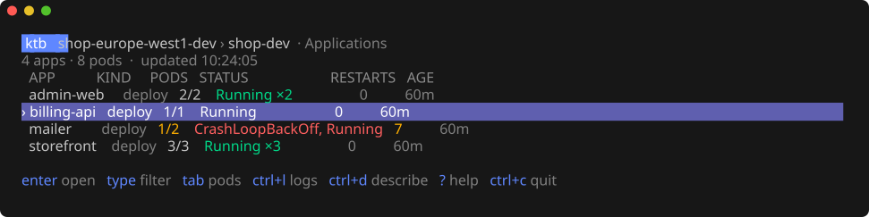
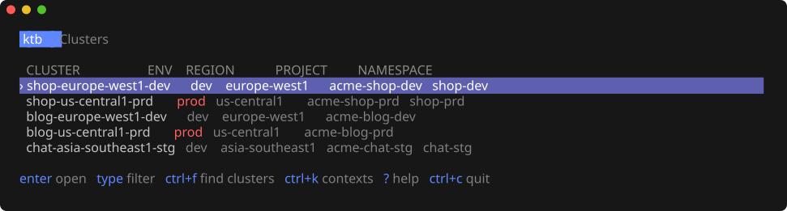
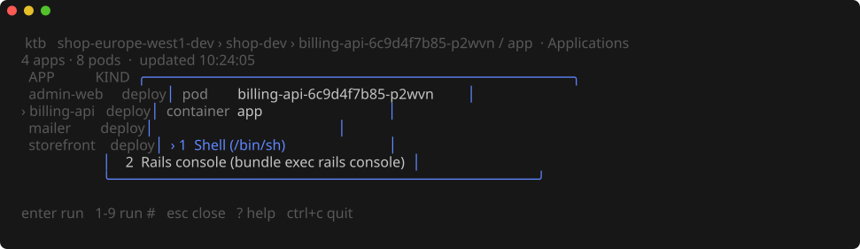

# ktb — a terminal browser for Kubernetes

`ktb` gets you from your shell to a shell or Rails console in the right pod in one step. Walk **cluster → namespace → application → pod → action**, or jump straight there with a bookmark:

```sh
ktb admin-shop-dev   # Rails console in the live admin-web pod on shop-europe-west1-dev
```



It is a single binary that drives your local `kubectl` and `gcloud`: no server, database or in-cluster component. It never edits or deletes Kubernetes resources itself. Selecting a GKE cluster may update your kubeconfig through `gcloud get-credentials`, and **commands you run inside a container can change its state** — `ktb` never runs them on its own and never retries them.

- [Quick start](#quick-start)
- [Features](#features)
- [Installation](#installation)
- [Usage](#usage)
- [Configuration](#configuration)
- [Access and permissions](#access-and-permissions)

## Quick start

```sh
git clone https://github.com/alexrails/kubernetes-terminal-browser.git
cd kubernetes-terminal-browser
make install   # builds and installs ~/.local/bin/ktb
ktb
```

No configuration is needed: without a cluster list, `ktb` shows the GKE clusters already in your kubeconfig, and `ctrl+f` finds more through `gcloud`.

## Features

- **Bookmarks** — `ktb NAME` opens an application's live pod and runs its action, whatever the pod hash is after a deploy.
- **Applications, not pods** — pods are grouped by Deployment, StatefulSet, DaemonSet, CronJob or Job; `Tab` shows the flat pod list.
- **Fuzzy type-to-search** on every list: `adweb` finds `admin-web`.
- **Action menu** — Shell, Rails console or your own commands, on any container of the pod.
- **Prod protection** — a red `PROD` badge, and every command in a container needs a `y`.
- **Cluster discovery** — from kubeconfig and `gcloud`; `get-credentials` runs only when a context is missing.
- Logs (tail, follow, previous), `describe` with the pod's events, and a manual mode for interactive credential plugins.

macOS and Linux only; Windows is not supported.

## Installation

### Requirements

| Tool | Needed for |
| --- | --- |
| Go 1.26.1+ ([install](https://go.dev/doc/install)) | Building from source |
| `kubectl` ([macOS](https://kubernetes.io/docs/tasks/tools/install-kubectl-macos/), [Linux](https://kubernetes.io/docs/tasks/tools/install-kubectl-linux/)) | Every run. Keep it within one minor version of your API servers. |
| `gcloud` ([install](https://cloud.google.com/sdk/docs/install)) | GKE clusters only. Without it, existing contexts still open with `ctrl+k`. |
| `make` | The build commands below |

`ktb` also needs a real terminal on stdin and stdout; it refuses to start from a pipe or a non-interactive CI job. On macOS, `brew install go kubectl` covers the first two.

Before the first run, make sure plain `kubectl` works for the context you plan to use:

```sh
kubectl --context CONTEXT_NAME --namespace NAMESPACE get pods
```

If it asks you to log in, finish that first. `ktb` does not need access to every namespace: one known namespace with `list pods` is enough.

### Install and upgrade

```sh
make install                    # ~/.local/bin/ktb
make install PREFIX=/usr/local  # $PREFIX/bin/ktb
```

Run it again after `git pull` to upgrade. It reports whether the install directory is in `PATH` and whether `kubectl` and `gcloud` are found; it does not install them. It replaces the binary with a new file, because macOS kills a signed binary that was overwritten in place (exit code 137).

`make build` only builds `./bin/ktb`. Without `make`: `./scripts/go build -trimpath -o bin/ktb ./cmd/ktb`. The first build downloads Go modules, so it needs access to the Go module proxy.

## Usage

```
ktb [flags] [bookmark]
```

The start screen lists bookmarks; `Tab` switches to clusters. Without bookmarks it opens on clusters, and without clusters on kubeconfig contexts. The bottom line always shows the keys of the current screen, and `?` opens full help.

### Clusters

The cluster list comes from three places:

1. **`clusters.yaml`** — your pinned list, see [Configuration](#clustersyaml).
2. **kubeconfig** — when `clusters.yaml` lists no clusters, every context named `gke_<project>_<region>_<cluster>` (that is, every cluster `get-credentials` has run for) is shown.
3. **`ctrl+f`** — searches through `gcloud` and adds what is missing:
   - with nothing typed, in the projects already known from `clusters.yaml`, kubeconfig and `gcloud config configurations`;
   - after typing a project ID prefix on the cluster screen (for example `acme-`), in every project whose ID starts with it. The prefix is filtered by the server; more than 300 matching projects asks for a longer prefix.

   The search runs in the background with `--quiet`, so an expired login shows an error instead of a prompt: run `gcloud auth login` and press `ctrl+f` again. Projects where listing fails are skipped, zonal clusters are not shown, and found clusters are not saved. Every project of the account is never scanned: there can be thousands.



**Enter on a cluster** opens its context from kubeconfig. Only if the context is missing does the TUI hand the terminal to `gcloud container clusters get-credentials NAME --region REGION --project PROJECT`; `ctrl+r` on a cluster forces that, for example after the cluster was recreated. `ktb` never calls `kubectl config use-context`, but `get-credentials` itself switches the current context.

The namespace list follows. The cluster's `namespace` from `clusters.yaml` is preselected, otherwise the context's namespace or `default`. Without `list namespaces` permission, type a name and press Enter. A namespace picked by hand is remembered per context until `ktb` exits; `ctrl+n` changes it later.

### Bookmarks

Enter on a bookmark, or `ktb NAME` from the shell, opens its cluster and namespace, finds its application and picks the best pod: running and ready, newest first. The bookmark's `action` runs at once; without one, the action menu opens.

### Applications and pods

Pods are grouped by owner: a ReplicaSet → its Deployment, a Job with a numeric suffix → its CronJob, plus StatefulSet, DaemonSet and Job; a pod without an owner is its own application. `PODS` shows ready/active pods (yellow when not all are ready) or `N done` for finished jobs; `STATUS` lists pod states worst first, such as `CrashLoopBackOff, Running ×2`.

Enter on an application with one pod opens the action menu; with several pods, their list. The menu works on the container `kubectl exec` would pick without `-c` (the `kubectl.kubernetes.io/default-container` annotation, otherwise the first); `Tab` switches the container, and `1`–`9` run an action by number.



Refreshes keep the selection: an application by name, a pod by UID. A failed refresh keeps the old rows marked `STALE`.

### Running commands

Before every exec, `ktb` fetches the pod again and compares its UID: a pod replaced under the same name must be selected again, and nothing is ever retried on a replacement. It then hands the terminal to `kubectl exec`, and returns to the same list when the command exits. On a prod cluster a confirmation window comes first; logs and describe never ask.

Exec does not start in a container that is not running; its logs may still be available. Action arguments are passed as they are, without a local shell.

### Logs and describe

`ctrl+l` opens the last 200 lines with timestamps, without follow:

| Key | Action |
| --- | --- |
| `f` / `p` | Toggle follow / the previous container instance |
| `t` | Tail size `50 → 200 → 1000` |
| `r` | Reconnect with the current options |
| `↑` `↓` `PgUp` `PgDn` | Scroll; scrolling up pauses auto-scroll |
| `Esc` / `q` | Close and stop the kubectl process |

The buffer keeps up to 10,000 lines and 10 MiB, and control characters from logs are not passed to the terminal. In [manual access mode](#authorization-modes), `r` or Enter instead hands the terminal to `kubectl logs` directly.

`ctrl+d` shows `describe` for the pod, with the events of that pod UID. If events are forbidden, the description still opens with the error below it.

### Keys

Typing on any list filters it; commands therefore use `ctrl`.

| Key | Where | Action |
| --- | --- | --- |
| letters, digits | Lists | Fuzzy filter; `Backspace` edits, `ctrl+u` clears |
| `↑` `↓` `PgUp` `PgDn` `Home` `End` | Lists | Move |
| `Enter` | Lists | Open; on an application or pod, the action menu |
| `Tab` | Start, pods, menu | Bookmarks ⇄ clusters · applications ⇄ pods · next container |
| `Esc` | Everywhere | Clear the filter, then back |
| `ctrl+s` / `ctrl+l` / `ctrl+d` | Pods, containers | Shell / logs / describe |
| `ctrl+r` | Lists | Refresh; on a cluster, run `get-credentials` again |
| `ctrl+f` | Start, contexts | Find GKE clusters (see [Clusters](#clusters)) |
| `ctrl+g` / `ctrl+k` | Lists | Start screen / kubeconfig contexts |
| `ctrl+n` | Pods | Change namespace |
| `ctrl+b` | Pods | Re-enable background reads after manual mode |
| `1`–`9` | Action menu | Run an action by number |
| `y` | Prod confirmation | Run; any other key cancels |
| `?` / `ctrl+c` | Everywhere | Help / quit |

## Configuration

Both files live in `~/.config/ktb/` (or `$XDG_CONFIG_HOME/ktb/`), are optional, and reject unknown fields. Check them without connecting to a cluster:

```sh
ktb --check-config
```

### `clusters.yaml`

Pinned clusters and bookmarks. Write your own; [`clusters.example.yaml`](clusters.example.yaml) only shows the format with fictional names. Once the file lists a cluster, kubeconfig contexts are no longer added automatically (`ctrl+f` still works). `ctrl+f` or `gcloud container clusters list --project PROJECT` shows the exact names and regions.

```yaml
clusters:
  - name: shop-europe-west1-dev     # as in get-credentials NAME
    region: europe-west1            # a region, not a zone
    project: acme-shop-dev
    namespace: shop-dev             # optional: preselected namespace
  - name: shop-us-central1-prd
    region: us-central1
    project: acme-shop-prd
    env: prod                       # optional: prod or dev

targets:
  - name: admin-shop-dev            # ktb admin-shop-dev; letters, digits, . _ -
    cluster: shop-europe-west1-dev  # a name from clusters
    namespace: shop-dev             # optional: defaults to the cluster's
    app: admin-web                  # the APP column: Deployment, StatefulSet, CronJob…
    container: app                  # optional: defaults to the pod's default container
    action: rails-console           # optional: an action id; empty opens the menu
```

Without `env`, a cluster is prod when its name or project ends in `-prd` or `-prod`. The same name, region and project cannot repeat.

### `config.yaml`

Refresh, timeouts and actions. The defaults are `refresh: 5s`, `timeout: 15s` and the two actions below; [`config.example.yaml`](config.example.yaml) holds them as a starting point.

```yaml
refresh: 5s        # pod refresh interval; 0 disables, otherwise at least 1s
timeout: 15s       # deadline for short reads, 1s to 5m; not applied to exec
actions:           # replaces the default list
  - id: sh
    label: Shell (/bin/sh)
    argv: ["/bin/sh"]
    stdin: true
    tty: true
  - id: rails-console
    label: Rails console (bundle exec rails console)
    argv: ["bundle", "exec", "rails", "console"]
    stdin: true
    tty: true
```

`id` and `label` must be unique, and `tty: true` needs `stdin: true`. `argv` is a list of separate arguments, not a command line; for shell syntax, ask for it: `argv: ["sh", "-lc", "echo ready"]`. `ctrl+s` runs the action with `id: sh`, or `/bin/sh` when there is none.

### Flags

| Flag | Default |
| --- | --- |
| `--kubeconfig PATH` | kubectl's own: `KUBECONFIG` or `~/.kube/config`. When set, it is also passed to `gcloud`, so credentials land in the same file. |
| `--namespace NAME` | The context's namespace |
| `--config PATH`, `--clusters PATH` | `~/.config/ktb/config.yaml`, `~/.config/ktb/clusters.yaml`; an explicit path must exist |
| `--kubectl PATH`, `--gcloud PATH` | `kubectl`, `gcloud` from `PATH` |
| `--refresh DURATION`, `--timeout DURATION` | From `config.yaml` |
| `--check-config` | Validate both files and exit |
| `--version`, `--help` | Print the version or flag help and exit |

## Access and permissions

### Kubernetes permissions

| Feature | Needs |
| --- | --- |
| Pod list | `list pods` in the namespace |
| Exec, logs, describe | `get pods`, plus `pods/exec` or `pods/log` |
| Namespace list | `list namespaces` (optional: you can type the name) |
| Events in describe | `list events` (optional) |

`ktb` makes no `auth can-i` preflight calls. The verb `pods/exec` needs depends on your kubectl version and cluster, so test it with a real exec.

### Authorization modes

Reads run in the background without stdin, so they can never prompt. When credentials fail, background retries stop and the header shows the context's `access:` mode; `ctrl+r` then reads once in the foreground, where a credential plugin may ask you to log in.

- A context whose plugin has `interactiveMode: Always` starts in manual mode and never polls.
- After a foreground login `ktb` tries one background read; if that needs a login again, the context stays `ManualOnly` and `ctrl+r` keeps reading in the foreground.
- `ctrl+b` on the pod screen re-enables background reads (not for `Always`). After editing kubeconfig, reload contexts with `ctrl+k`, `ctrl+r`.
